## Azure Purview Setup

1. From **Azure Portal**, search for **purview** in the resource group and click on the resource.

   

2. The Azure Purview resource window will open, **click** on Open Azure Purview Studio and the Azure Purview Studio will open in a new window.
  
   

3. In Azure Purview Portal, go to **Data Map**, choose **Data Sources**, and then click **Register** to add a new data source.

   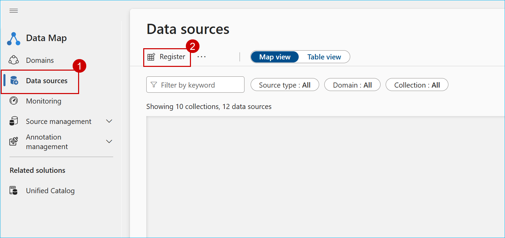

4. Select **Azure SQL Database** and then click **Continue**.

   

5. On the Register data source page,provide the **data source name** select the required **subscription**, choose the **SQL Server** you want to connect to, accept the default endpoint, and then click **Register**.

   

6. Click **Register** to add a new data source, select **Fabric**, and then choose **Continue**.

   

7. On the Register data source page, enter the data source name and click **Register**.

   

8. You can follow the same steps to add any other data sources you need.

   

## Adding the Governance domains

1. From the left navigation menu, go to **Solutions** and then select **Unity Catalog**.

    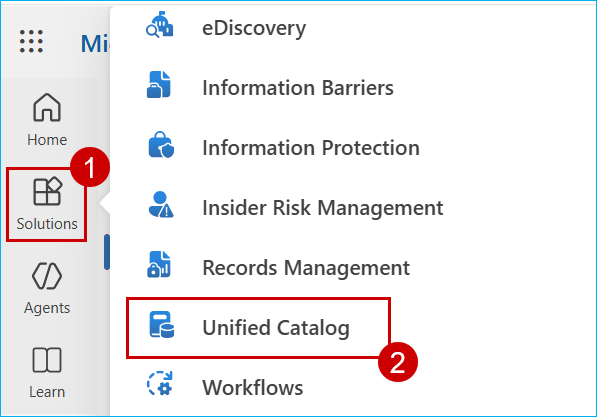

2. Expand **Catalog Management**, select **Governance Domains**, and then click **+ New Governance Domain**.

    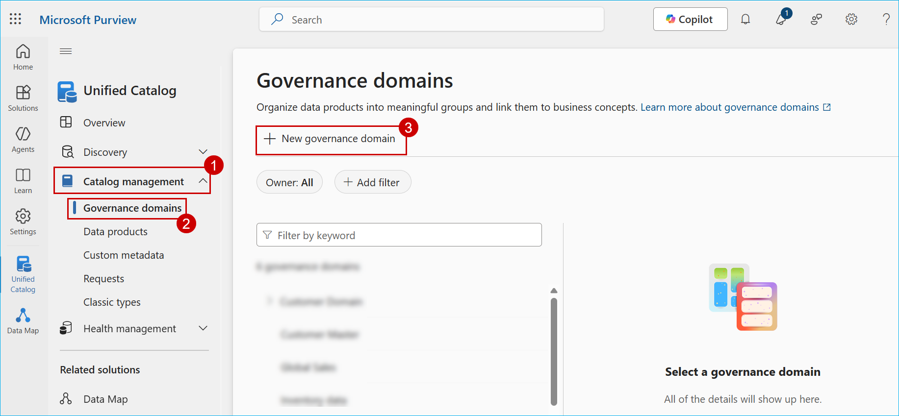

3. Enter the required **Name** and **Description**, select the Type, and then click **Next**.

    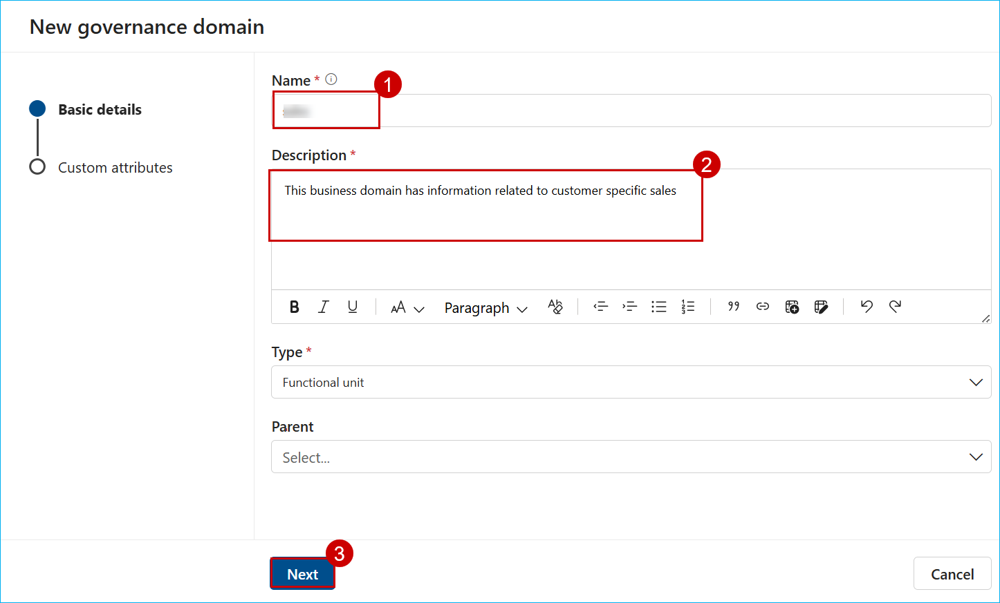

4.  On the Custom Attributes page, accept the default settings and click **Create** to finish creating the governance domain.

    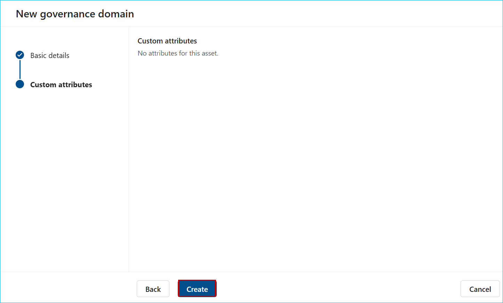

5. To assign permissions for a governance domain, select the domain, open Roles, click Add, and select **Governance Domain Owner**.

    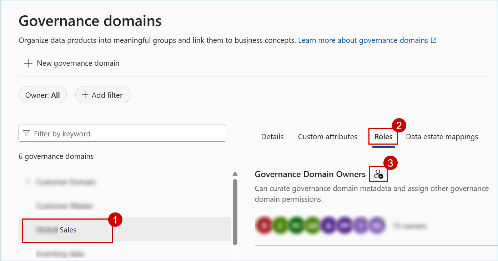

## Creating the Sensitivity label

1. From the left navigation menu, go to **Solutions** and then select **Information Protection**.

    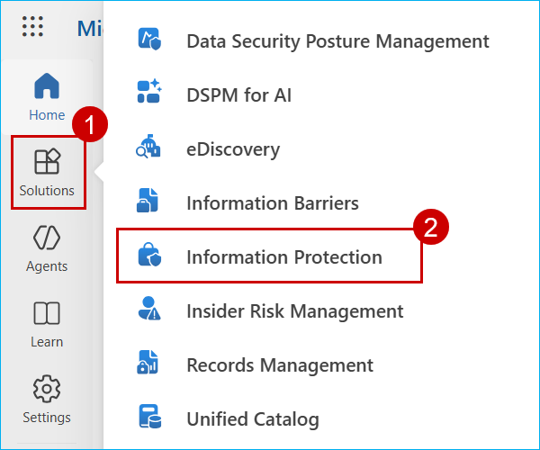

2. From the left navigation, select **Sensitivity Labels** and click **+ Create a label**.

    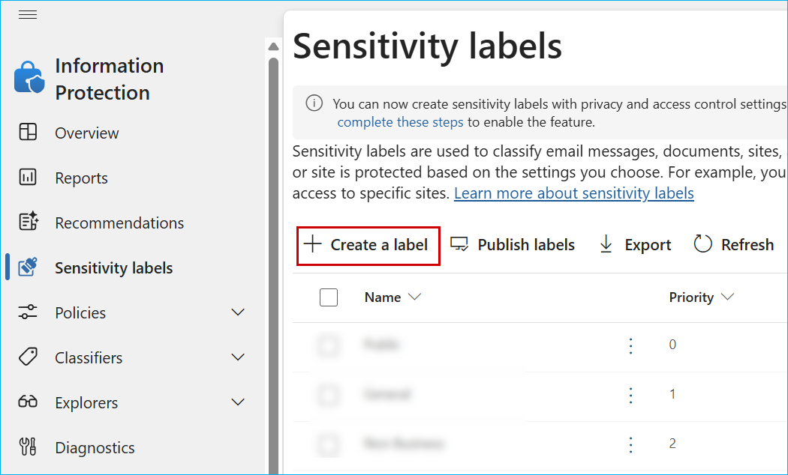

3. On the Label Details page, enter the required information such as **Name**, **Display Name**, and **Description**, then click **Next**.

    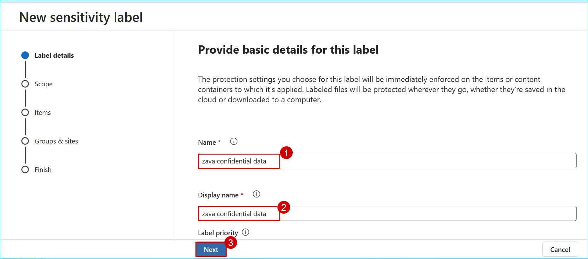

4. In the **Scope** section, select the required scope where the sensitivity label should be enabled

    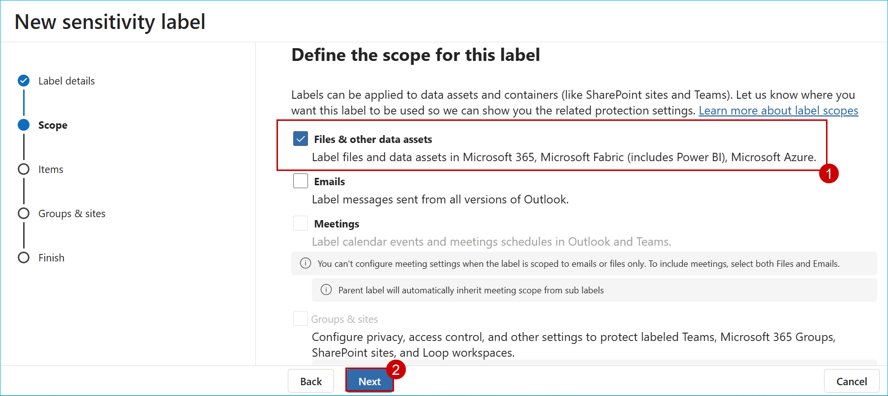

5. In the **Items** section, select Control access and click **Next**.

    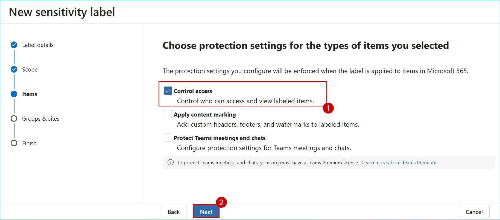

6. In the Access control section, select Configure access control, assign permissions to the sensitivity label by choosing the required users, and then click **Next**.

    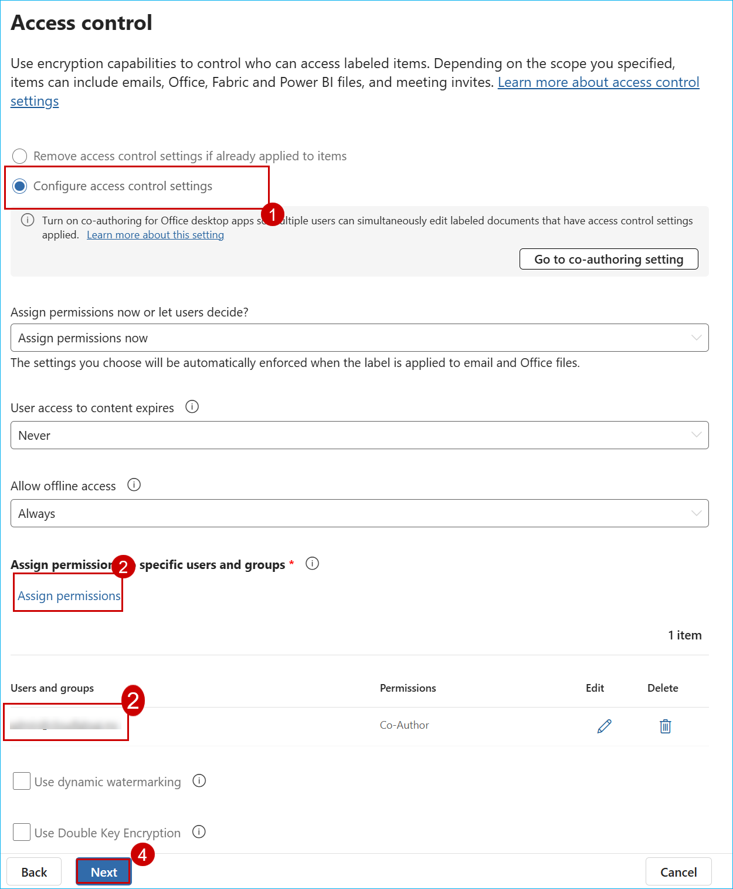

7. Review the settings, then click **Create label** to finalize.

    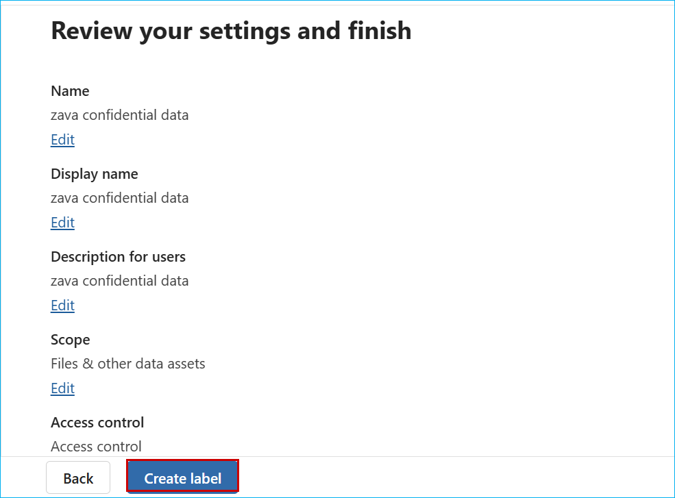

8. After creating the sensitivity label, create a policy label on top of it.

    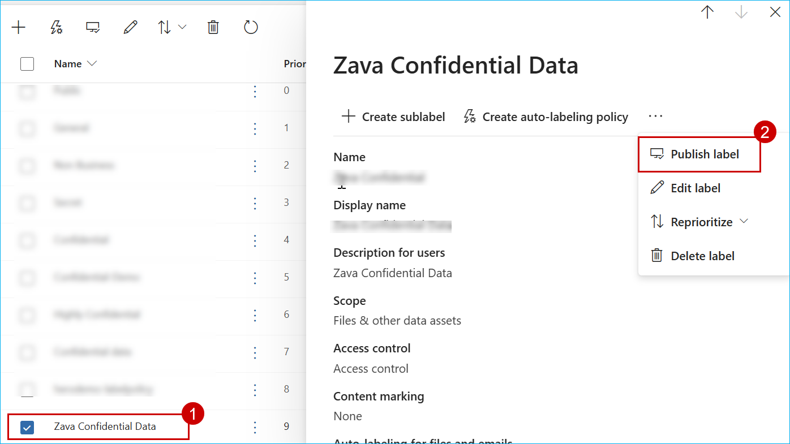

9. m 

    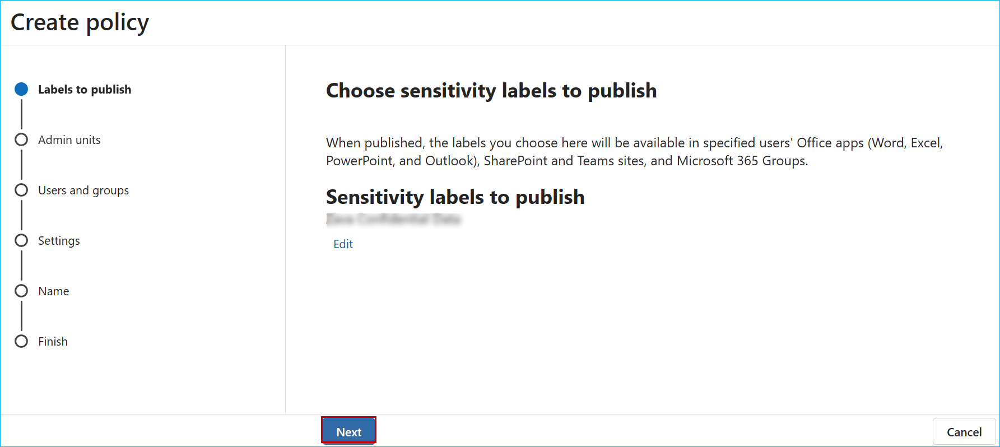

10. m

    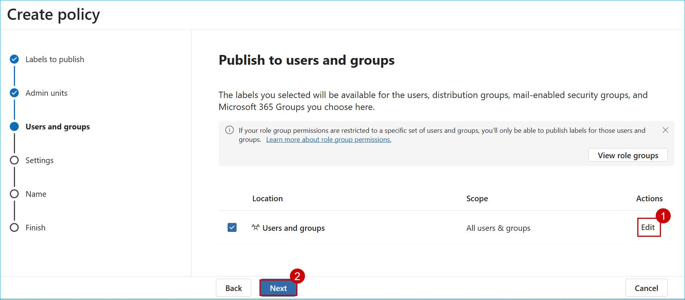

11. m

    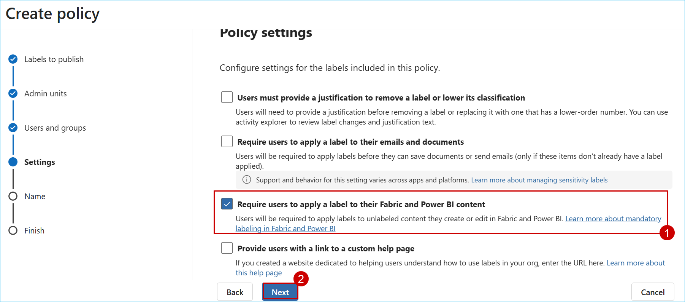

12. m

    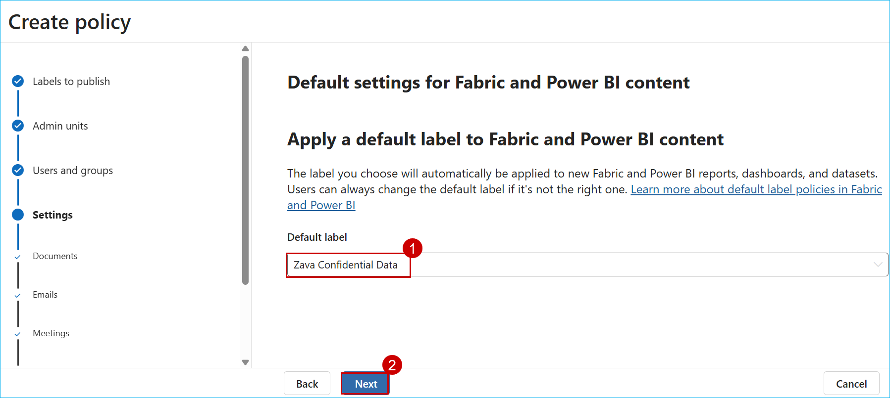

13. m

    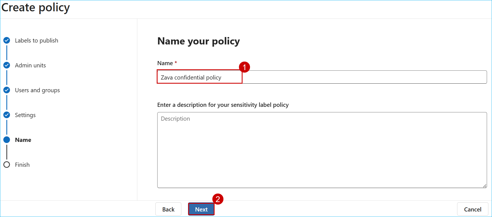

14. m 

    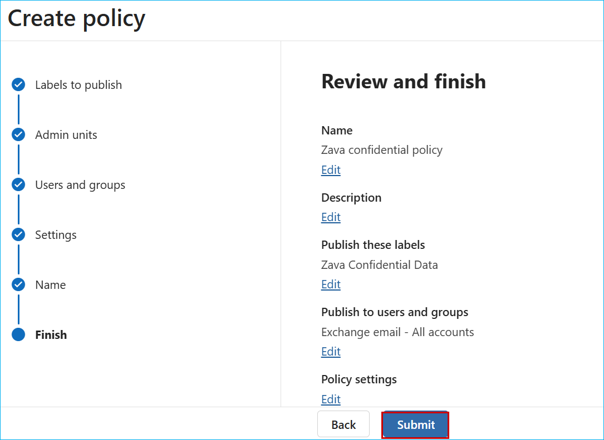

    