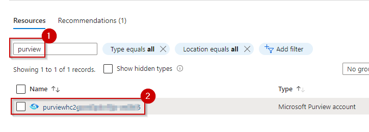
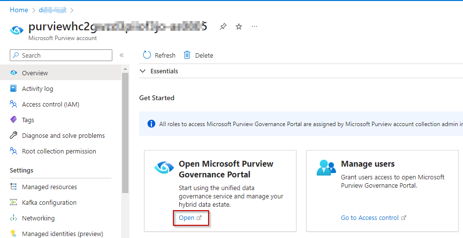
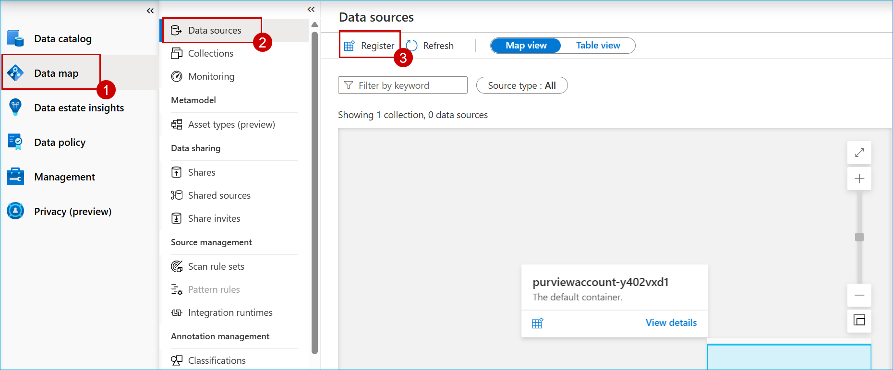
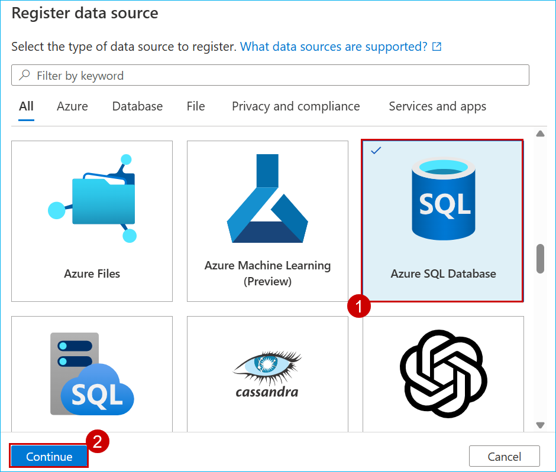
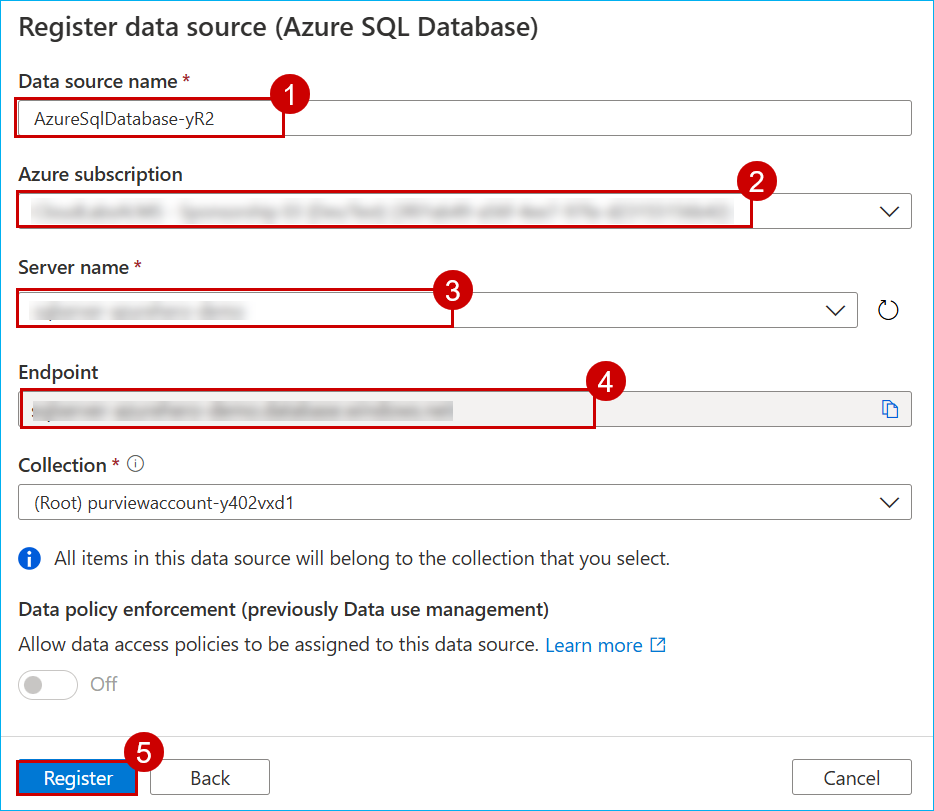
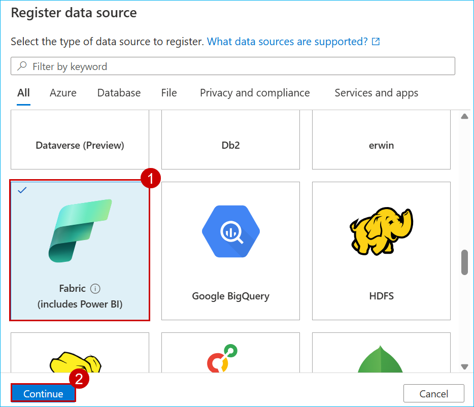
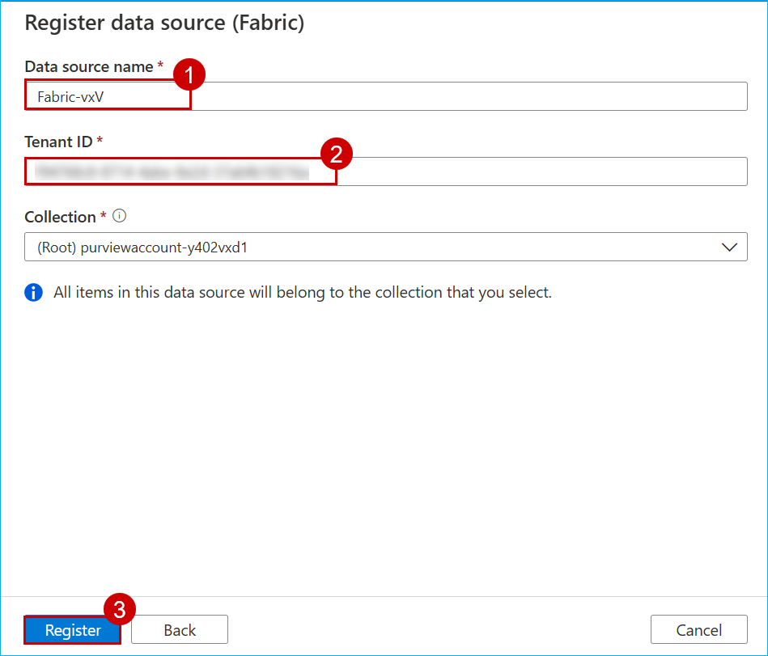
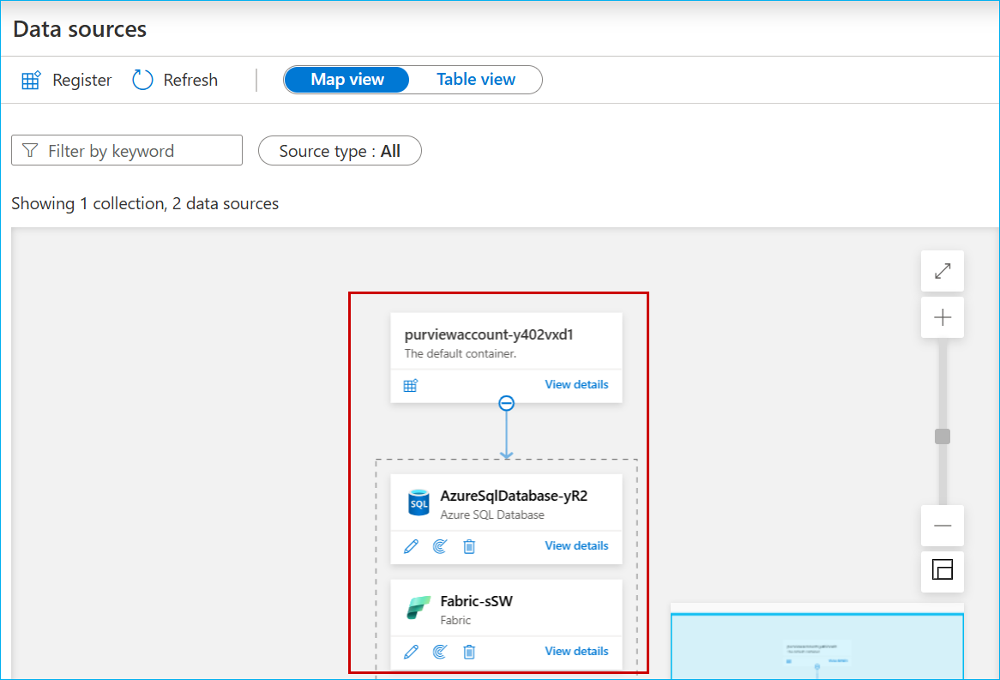

## Azure Purview Setup

1. From **Azure Portal**, search for **purview** in the resource group and click on the resource.

   

2. The Azure Purview resource window will open, **click** on Open Azure Purview Studio and the Azure Purview Studio will open in a new window.
  
   

3. In Azure Purview Studio, go to **Data Map**, choose **Data Sources**, and then click **Register** to add a new data source.

   

4. Select **Azure SQL Database** and then click **Continue**.

   

5. On the Register data source page,provide the **data source name** select the required **subscription**, choose the **SQL Server** you want to connect to, accept the default endpoint, and then click **Register**.

   

6. Click **Register** to add a new data source, select **Fabric**, and then choose **Continue**.

   

7. On the Register data source page, enter the data source name and click **Register**.

   

8. You can follow the same steps to add any other data sources you need.

   